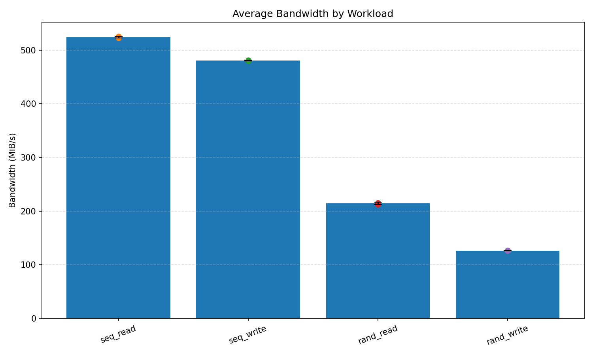
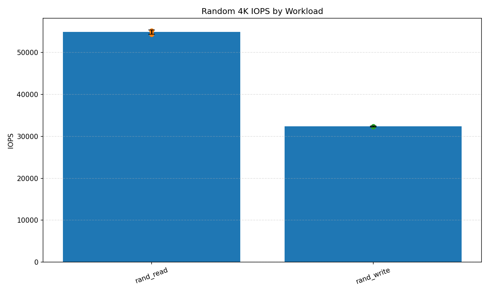
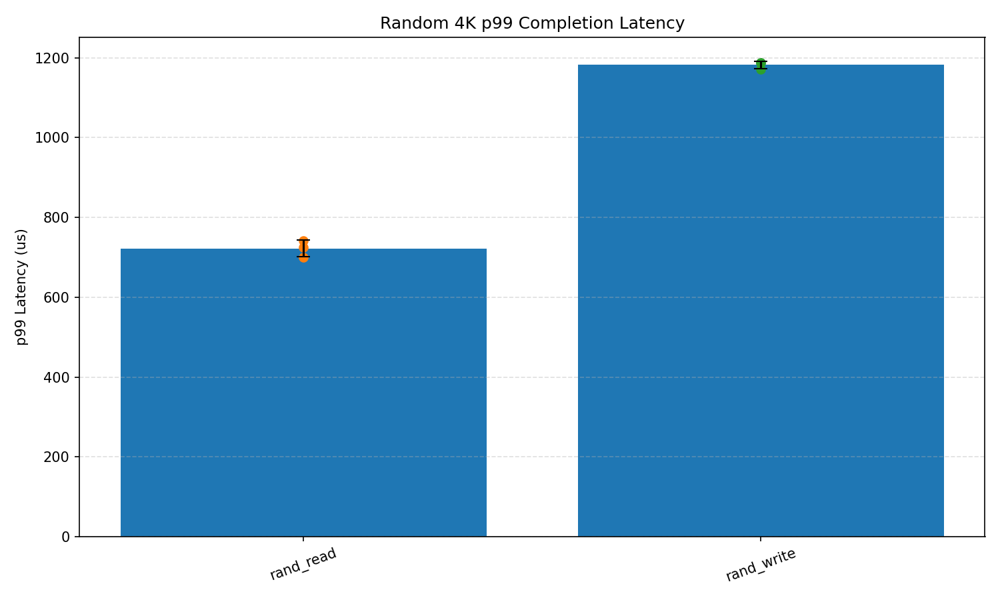
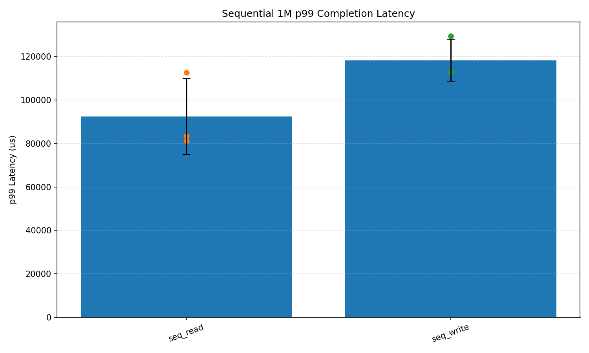
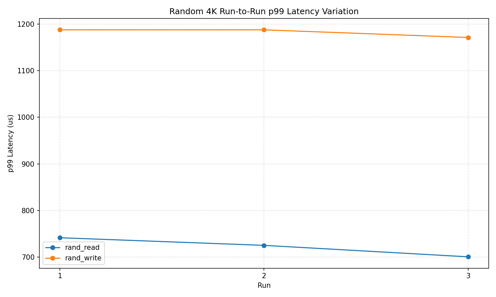
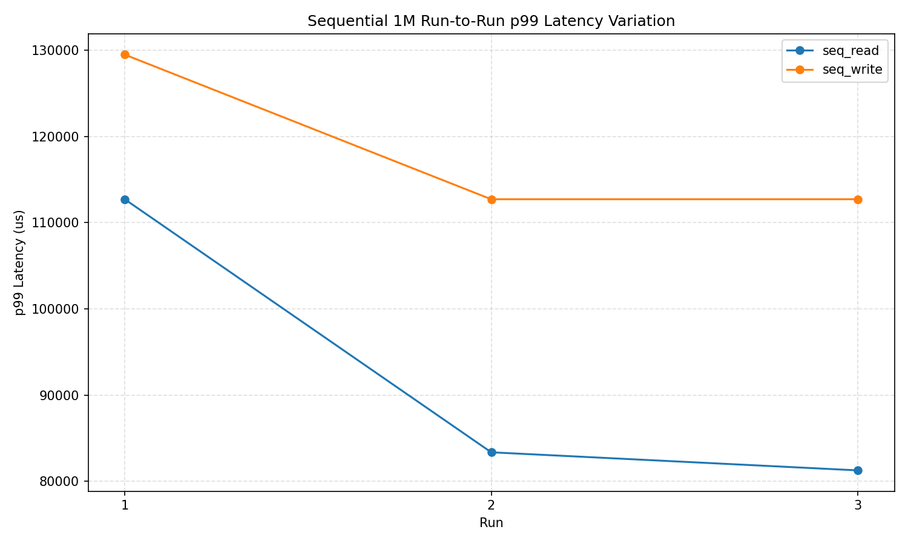
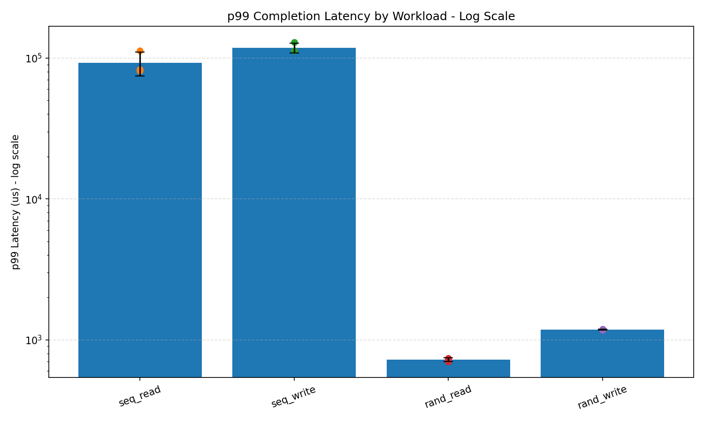

# Baseline Report v1

## 1. 실험 목적

이 실험의 목적은 단순히 SSD의 최고 속도를 측정하는 것이 아니라, SSD Validation 관점에서 반복 가능한 baseline 측정 구조를 만드는 것이다.

이번 baseline에서는 다음 질문에 답하는 것을 목표로 했다.

1. 동일한 조건에서 fio workload를 반복 실행했을 때 결과가 얼마나 안정적인가?
2. Sequential read/write와 random read/write workload에서 bandwidth, IOPS, latency 특성이 어떻게 달라지는가?
3. 평균 성능뿐 아니라 p99 latency와 반복 측정 변동성을 함께 볼 수 있는가?
4. 이후 QD sweep, block size sweep, direct I/O vs buffered I/O 비교를 위한 기준선을 만들 수 있는가?

이 실험은 최종 성능 평가가 아니라, 이후 SSD mini-lab의 기준점 역할을 하는 1차 baseline이다.

---

## 2. 실험 환경

| 항목 | 내용 |
|---|---|
| Host OS | Windows |
| 분석 환경 | Windows Python / 필요 시 WSL 분석 가능 |
| 대상 장치 | SanDisk Portable SSD 2TB |
| fio 실행 위치 | Windows |
| 작업 폴더 | `D:\ssd_lab` |
| 결과 폴더 | `D:\ssd_lab\results` |
| plot 폴더 | `D:\ssd_lab\results\plots` |
| fio 결과 형식 | JSON |
| 요약 CSV | `D:\ssd_lab\results\fio_summary.csv` |

### 환경 관련 메모

초기에는 WSL2에서 외장 SSD를 block device로 직접 인식시킨 뒤 fio를 실행하려 했으나, USB 외장 SSD가 WSL에서 안정적으로 `/dev/sdX` 장치로 잡히지 않았다.

따라서 현재 구조는 다음과 같이 정리했다.

- 실제 fio workload 실행: Windows
- 결과 JSON 저장: Windows 파일시스템
- CSV 파싱 및 그래프 생성: Python
- 추후 분석 및 문서화: Windows 또는 WSL

이 방식은 raw block device 실험은 아니지만, 현재 장비 조건에서 반복 가능한 실험 구조를 만드는 데 더 적합하다고 판단했다.

---

## 3. fio 공통 조건

모든 baseline workload는 아래 조건을 공통으로 사용했다.

| 항목 | 값 |
|---|---|
| repeats | 3 |
| size | `2G` |
| direct | `1` |
| thread | `1` |
| time_based | `1` |
| runtime | `30s` |
| ramp_time | `3s` |
| group_reporting | enabled |
| output-format | JSON |

### 조건 선택 이유

- `time_based=1`: 정해진 시간 동안 workload를 유지하여 비교 가능성을 높이기 위함
- `runtime=30`: baseline 단계에서 빠르게 반복 측정하기 위한 짧은 테스트 시간
- `ramp_time=3`: 초기 과도 구간을 일부 제외하기 위함
- `repeats=3`: 단발성 측정이 아니라 반복 측정 기반으로 변동성을 보기 위함
- `direct=1`: OS page cache 영향을 줄이고 storage path에 더 가까운 결과를 보기 위함

---

## 4. workload 4종 조건

| workload | rw | block size | iodepth | 목적 |
|---|---:|---:|---:|---|
| seq_read | read | 1M | 32 | Sequential read throughput 확인 |
| seq_write | write | 1M | 32 | Sequential write throughput 확인 |
| rand_read | randread | 4K | 32 | Random read IOPS 및 latency 확인 |
| rand_write | randwrite | 4K | 32 | Random write IOPS 및 latency 확인 |

### 해석 시 주의점

Sequential workload는 `1M` block size를 사용하고, random workload는 `4K` block size를 사용한다.

따라서 모든 workload의 IOPS와 latency를 단순히 같은 기준으로 비교하면 안 된다. IOPS는 random 4K workload에서 더 자연스럽고, bandwidth는 sequential workload에서 더 자연스럽다.

---

## 5. 결과 요약 표

### 5.1 평균 성능 요약

| workload | avg bandwidth (MiB/s) | avg IOPS | avg clat mean (us) | avg clat p99 (us) |
|---|---:|---:|---:|---:|
| seq_read | 524.43 | 523.76 | 60906.40 | 92449.45 |
| seq_write | 480.35 | 479.32 | 66418.27 | 118314.33 |
| rand_read | 214.42 | 54891.75 | 345.53 | 722.26 |
| rand_write | 126.41 | 32360.71 | 503.01 | 1182.38 |

### 5.2 반복 측정 변동성

CV는 coefficient of variation이며, 표준편차를 평균으로 나눈 값이다. 값이 낮을수록 반복 측정 결과가 안정적이라는 의미다.

| workload | bandwidth CV | IOPS CV | p99 latency CV |
|---|---:|---:|---:|
| seq_read | 0.0027 | 0.0017 | 0.1902 |
| seq_write | 0.0017 | 0.0017 | 0.0819 |
| rand_read | 0.0095 | 0.0095 | 0.0285 |
| rand_write | 0.0026 | 0.0026 | 0.0080 |

---

## 6. 그래프

### 6.1 전체 bandwidth 비교

이 그래프는 각 workload 조건에서 관측된 평균 bandwidth를 보여준다.

Sequential read/write는 각각 약 524 MiB/s, 480 MiB/s 수준으로 관측되었다. Random read/write는 4K random access 조건이므로 sequential workload보다 낮은 bandwidth를 보였다.

---

### 6.2 Random 4K IOPS 비교

Random 4K workload에서는 read가 write보다 높은 IOPS를 보였다.

- rand_read: 약 54.9K IOPS
- rand_write: 약 32.4K IOPS

rand_write는 rand_read 대비 약 59% 수준의 IOPS를 보였다.

---

### 6.3 Random 4K p99 latency 비교

Random 4K workload에서 p99 latency는 다음과 같이 관측되었다.

- rand_read: 약 722 us
- rand_write: 약 1182 us

rand_write의 p99 latency는 rand_read보다 약 1.64배 높았다. 이 결과는 random write workload가 read보다 tail latency 측면에서 더 불리하게 나타났음을 보여준다.

---

### 6.4 Sequential 1M p99 latency 비교

Sequential workload는 1M block size를 사용했기 때문에 p99 latency가 random 4K workload보다 훨씬 크게 나타난다.

이 값은 random workload와 직접 비교하기보다는, sequential read/write 간 차이와 반복 측정 변동성을 보는 용도로 해석해야 한다.

---

### 6.5 Random p99 latency run-to-run variation

Random workload에서는 세 번의 반복 측정 간 p99 latency 변동이 크지 않았다.

특히 rand_write는 평균 p99 latency 자체는 rand_read보다 높지만, 반복 간 변동성은 낮게 관측되었다. 즉, 이 baseline에서는 random write가 더 느리지만 비교적 안정적인 패턴을 보였다.

---

### 6.6 Sequential p99 latency run-to-run variation

Sequential workload에서는 첫 번째 run의 p99 latency가 이후 run보다 높게 관측되었다.

반복 횟수가 3회뿐이므로 원인을 단정할 수는 없다. 다만 초기 장치 상태, Windows 백그라운드 I/O, SSD 내부 상태 변화, 파일시스템 상태 등의 영향을 후속 실험에서 분리할 필요가 있다.

---

### 6.7 전체 p99 latency log-scale 비교

Sequential 1M workload와 random 4K workload는 latency scale이 크게 다르다. 따라서 전체 workload를 한 그래프에서 볼 때는 log scale이 더 적합하다.

---

## 7. 해석

### 7.1 Sequential throughput

Sequential read는 약 524 MiB/s, sequential write는 약 480 MiB/s로 측정되었다. 두 workload 모두 bandwidth와 IOPS의 CV가 매우 낮아 반복 측정 결과가 안정적이었다.

다만 sequential p99 latency의 CV는 상대적으로 높았다.

- seq_read p99 latency CV: 0.1902
- seq_write p99 latency CV: 0.0819

이는 평균 throughput은 안정적이더라도 tail latency는 반복 측정에서 더 민감하게 흔들릴 수 있음을 보여준다.

---

### 7.2 Random read/write 비교

Random 4K workload에서는 read와 write의 차이가 명확했다.

| 항목 | rand_read | rand_write |
|---|---:|---:|
| IOPS | 54891.75 | 32360.71 |
| p99 latency (us) | 722.26 | 1182.38 |

rand_write는 rand_read보다 IOPS가 낮고 p99 latency가 높았다. 이는 baseline 수준에서 random write workload가 더 불리한 조건으로 관측되었다는 의미다.

다만 이 결과만으로 SSD 내부 동작 원인을 단정할 수는 없다. 예를 들어 garbage collection, SLC cache, thermal throttling, FTL 동작 같은 내부 원인은 추가 실험 없이 직접 증명할 수 없다.

---

### 7.3 반복 측정 안정성

반복 측정 안정성 관점에서는 random workload가 비교적 안정적으로 보였다.

- rand_read p99 latency CV: 0.0285
- rand_write p99 latency CV: 0.0080

특히 rand_write는 latency 자체는 높지만 반복 간 변동성은 낮았다. Validation 관점에서는 이것을 단순히 “나쁘다”라고만 해석하기보다, “높은 tail latency가 반복적으로 재현되는 workload”로 보는 것이 더 적절하다.

---

### 7.4 평균 latency와 p99 latency

모든 workload에서 p99 latency는 mean latency보다 높게 나타났다. 이는 평균값만으로는 tail latency를 설명할 수 없다는 점을 보여준다.

특히 SSD validation에서는 평균 성능뿐 아니라 p95, p99와 같은 tail latency 지표를 함께 확인해야 한다.

---

## 8. 한계

이번 baseline은 유효한 1차 결과이지만, 다음 한계를 가진다.

1. 테스트가 Windows 파일 기반 fio 실행으로 수행되었다.
   - raw block device 기반 실험이 아니므로 OS, filesystem, Windows storage stack의 영향이 포함될 수 있다.

2. 반복 횟수가 3회로 제한적이다.
   - 기본적인 run-to-run variation은 볼 수 있지만, 통계적으로 충분한 반복이라고 보기는 어렵다.

3. runtime이 30초로 짧다.
   - sustained workload, thermal throttling, long-tail latency를 보기에는 부족하다.

4. SSD 상태를 엄격히 통제하지 않았다.
   - preconditioning 여부, 여유 공간, 장치 온도, 사용 이력 등이 결과에 영향을 줄 수 있다.

5. SMART/NVMe 로그를 함께 수집하지 않았다.
   - 온도, media error, wear-level, throttling 관련 정보를 해석에 사용할 수 없다.

6. Sequential과 random workload의 block size가 다르다.
   - 1M sequential과 4K random의 IOPS/latency를 단순 비교하면 해석이 왜곡될 수 있다.

7. 내부 원인을 직접 증명할 수 없다.
   - 이번 결과는 관측 결과이며, SSD 내부 FTL, GC, cache 동작을 직접 확인한 것은 아니다.

---

## 9. 다음 실험 계획

다음 단계에서는 baseline 결과를 기준으로 변수 하나씩 바꾸며 실험을 확장한다.

### 9.1 QD sweep

목적: queue depth 변화에 따라 bandwidth, IOPS, p99 latency가 어떻게 변하는지 확인한다.

계획 조건:

| 항목 | 값 |
|---|---|
| QD | 1, 4, 16, 32 |
| workload | rand_read, rand_write 중심 |
| repeats | 3 |
| 주요 지표 | IOPS, bandwidth, clat mean, clat p99 |

예상 질문:

- QD가 증가하면 IOPS는 어느 지점까지 증가하는가?
- QD 증가가 p99 latency를 얼마나 악화시키는가?
- read/write에서 QD 민감도가 다르게 나타나는가?

---

### 9.2 Block size sweep

목적: block size 변화가 throughput과 latency에 미치는 영향을 확인한다.

계획 조건:

| 항목 | 값 |
|---|---|
| block size | 4K, 64K, 1M |
| workload | read/write 각각 |
| iodepth | 32 |
| repeats | 3 |

예상 질문:

- block size가 커질수록 bandwidth는 어떻게 변하는가?
- small block workload와 large block workload의 latency 특성은 어떻게 다른가?
- 4K random과 1M sequential 사이에 중간 지점인 64K는 어떤 패턴을 보이는가?

---

### 9.3 Direct I/O vs buffered I/O

목적: OS page cache 영향이 결과에 얼마나 반영되는지 확인한다.

계획 조건:

| 항목 | 값 |
|---|---|
| direct | 0, 1 |
| workload | seq_read, rand_read 중심 |
| repeats | 3 |

예상 질문:

- buffered I/O에서 read 결과가 과도하게 좋아지는가?
- direct I/O 설정이 SSD 자체 특성을 보는 데 더 적절한가?
- Windows 파일 기반 fio에서 cache 영향이 얼마나 큰가?

---

## 10. 결론

이번 baseline에서는 fio JSON 결과를 CSV로 정리하고, workload별 bandwidth, IOPS, mean latency, p99 latency, 반복 측정 변동성을 그래프로 확인했다.

핵심 관찰은 다음과 같다.

1. Sequential read/write의 평균 bandwidth는 반복 측정에서 안정적으로 관측되었다.
2. Random 4K write는 random read보다 낮은 IOPS와 높은 p99 latency를 보였다.
3. Random write는 latency 자체는 높았지만 반복 간 변동성은 낮았다.
4. Sequential workload의 p99 latency는 첫 번째 run에서 더 높게 나타나는 경향이 있었다.
5. 평균 latency만으로는 tail latency 특성을 설명하기 어렵기 때문에 p99 latency를 함께 봐야 한다.

이번 결과는 최종 결론이 아니라, 이후 QD sweep, block size sweep, direct/buffered 비교를 위한 기준선이다.