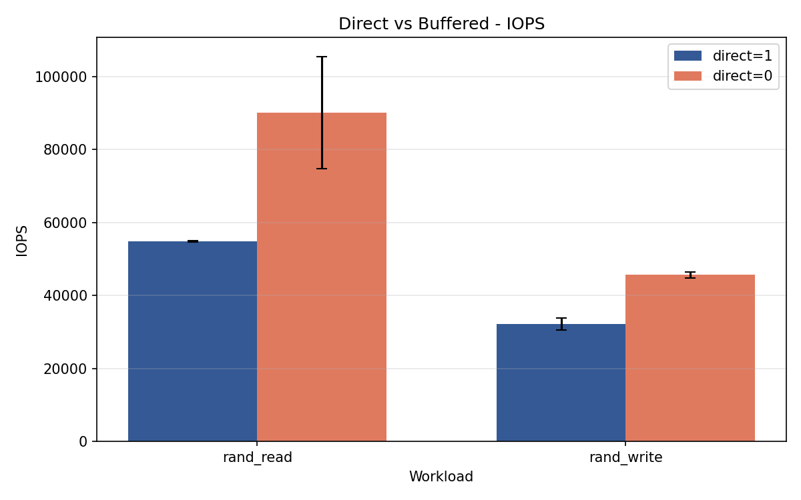
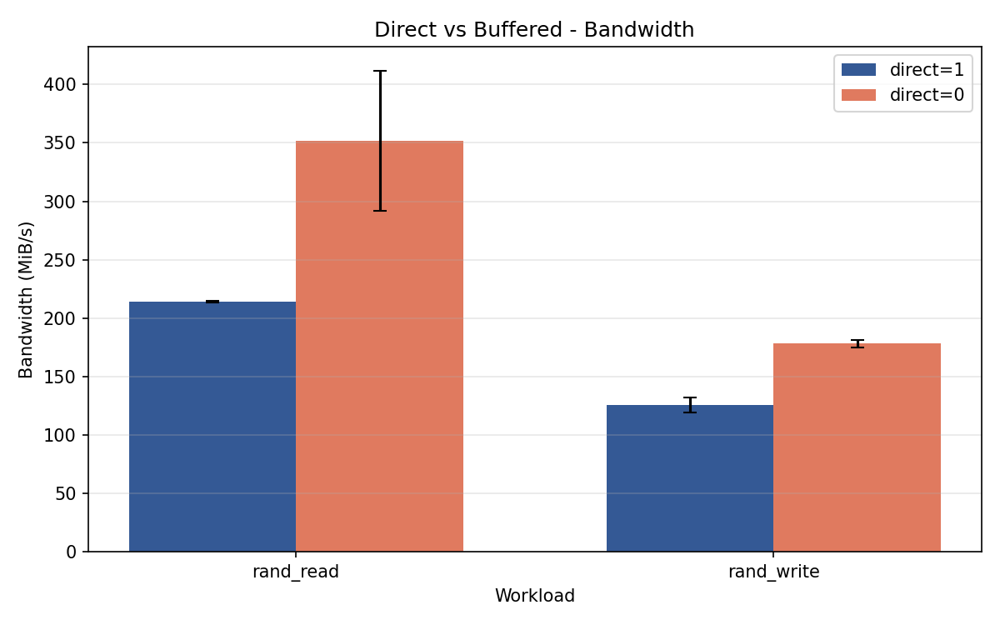
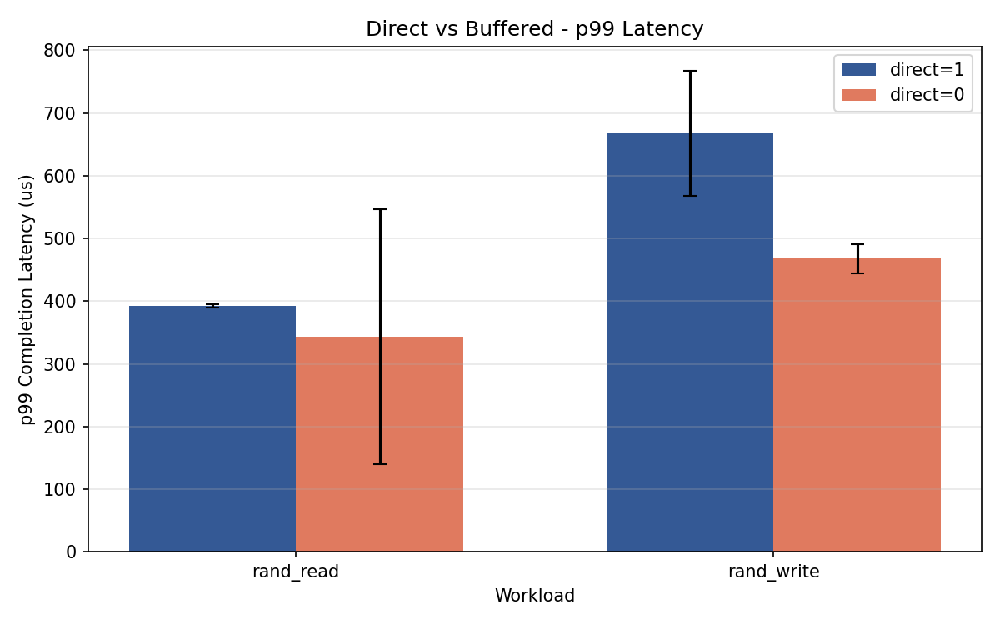
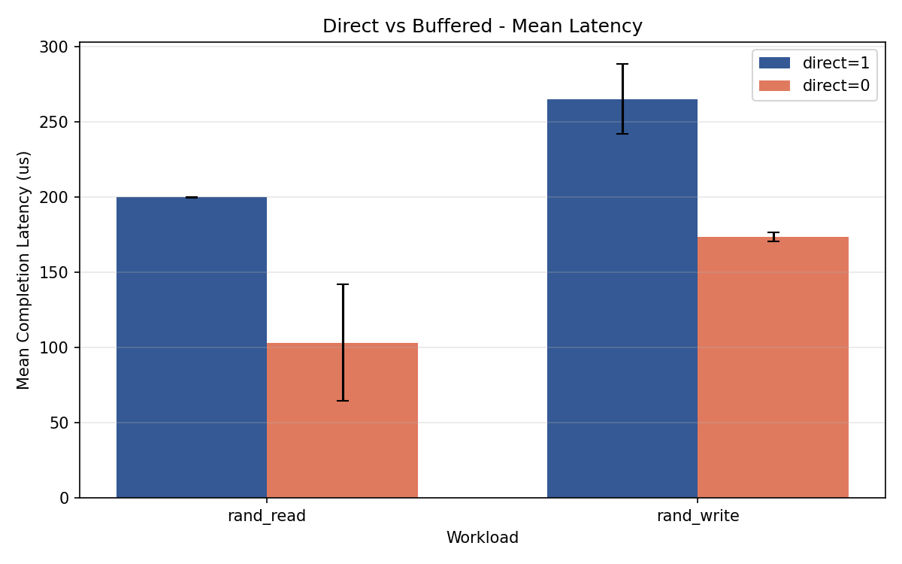

# Week 7 - Direct I/O vs Buffered I/O

## Purpose

This experiment compares fio random 4K read/write behavior with direct I/O enabled and disabled.

The main question is whether the result is closer to the storage device path (`direct=1`) or affected by the Windows filesystem/page-cache path (`direct=0`).

## Experiment Setup

| Item | Value |
|---|---:|
| Workloads | `rand_read`, `rand_write` |
| Block size | `4k` |
| iodepth | `16` |
| numjobs | `1` |
| size | `2G` |
| runtime | `30s` |
| repeats | `3` |
| direct modes | `direct=1`, `direct=0` |

Input JSON files are stored in `results/direct_buffered/`.

The prefill run creates the test file before the read tests and is excluded from the direct/buffered comparison.

## Parser Fix

`parse_fio_results.py` now extracts `direct0` / `direct1` from filenames into `direct_from_filename`.

Before this fix, files such as `rand_read_direct0_run1.json` were parsed as workload `rand_read_direct0`. That split the same workload into separate names and made grouped analysis awkward.

After the fix:

| File pattern | Parsed workload | direct_from_filename |
|---|---|---:|
| `rand_read_direct0_run1.json` | `rand_read` | 0 |
| `rand_read_direct1_run1.json` | `rand_read` | 1 |
| `rand_write_direct0_run1.json` | `rand_write` | 0 |
| `rand_write_direct1_run1.json` | `rand_write` | 1 |

The fio job option column `direct` is still preserved separately, so filename metadata and actual fio runtime options can be checked against each other.

## Outputs

| Output | Description |
|---|---|
| `results/direct_buffered_summary.csv` | Per-run parser output |
| `results/direct_buffered_grouped.csv` | Mean/std/min/max/CV by workload and direct mode |
| `results/direct_buffered_comparison.csv` | Buffered-over-direct ratios by workload |
| `results/direct_buffered_plots/direct_buffered_iops.png` | IOPS comparison |
| `results/direct_buffered_plots/direct_buffered_bandwidth.png` | Bandwidth comparison |
| `results/direct_buffered_plots/direct_buffered_p99_latency.png` | p99 latency comparison |
| `results/direct_buffered_plots/direct_buffered_mean_latency.png` | Mean latency comparison |

## Result Summary

| Workload | Mode | Avg BW (MiB/s) | Avg IOPS | Avg p99 clat (us) |
|---|---|---:|---:|---:|
| rand_read | direct=1 | 213.92 | 54,762.40 | 392.53 |
| rand_read | direct=0 | 351.89 | 90,083.22 | 343.38 |
| rand_write | direct=1 | 125.72 | 32,184.05 | 667.65 |
| rand_write | direct=0 | 178.26 | 45,635.12 | 467.63 |

Buffered-over-direct ratios:

| Workload | BW ratio | IOPS ratio | p99 latency ratio |
|---|---:|---:|---:|
| rand_read | 1.645 | 1.645 | 0.875 |
| rand_write | 1.418 | 1.418 | 0.700 |

For both random read and random write, `direct=0` reported higher bandwidth and IOPS than `direct=1`.

For latency, `direct=0` also reported lower p99 completion latency in this run:

- `rand_read`: p99 was about 12.5% lower with buffered I/O.
- `rand_write`: p99 was about 30.0% lower with buffered I/O.

## Plots









## Interpretation

The buffered results are faster in this Windows file-based fio setup, but that does not mean the SSD media itself became faster. `direct=0` allows the OS filesystem/cache path to participate, so read results can benefit from cache effects and write results can benefit from buffering or write-back behavior.

`direct=1` is therefore the better setting when the goal is to reduce OS cache influence and observe a path closer to storage-device behavior.

One notable detail is reproducibility:

| Workload | Mode | IOPS CV | p99 CV |
|---|---|---:|---:|
| rand_read | direct=1 | 0.0036 | 0.0060 |
| rand_read | direct=0 | 0.1701 | 0.5910 |
| rand_write | direct=1 | 0.0491 | 0.1493 |
| rand_write | direct=0 | 0.0169 | 0.0498 |

Buffered random read had much higher run-to-run variation. This suggests cache state or filesystem state strongly affected the `direct=0` read result.

## Limitations

- This is a Windows file-based fio experiment, not a raw block-device test.
- Each condition has only three runs.
- Runtime is 30 seconds, so long sustained behavior, thermal effects, and deeper SSD state transitions are not covered.
- The experiment does not collect SMART/NVMe telemetry.
- Buffered write results should not be interpreted as guaranteed durable-media completion behavior.

## Reproduction

```powershell
cd D:\ssd_lab

.\run_direct_buffered.ps1

python .\parse_fio_results.py `
  --input-dir D:\ssd_lab\results\direct_buffered `
  --output D:\ssd_lab\results\direct_buffered_summary.csv

python .\analyze_direct_buffered.py
```
