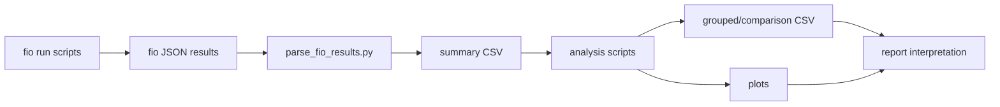
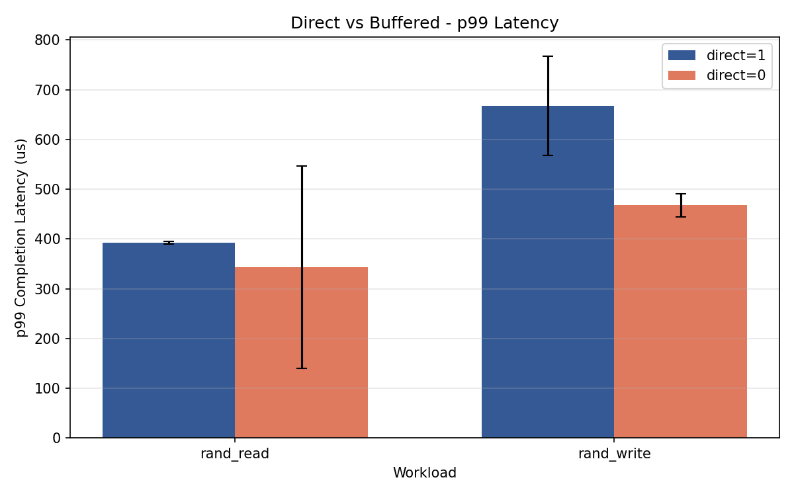
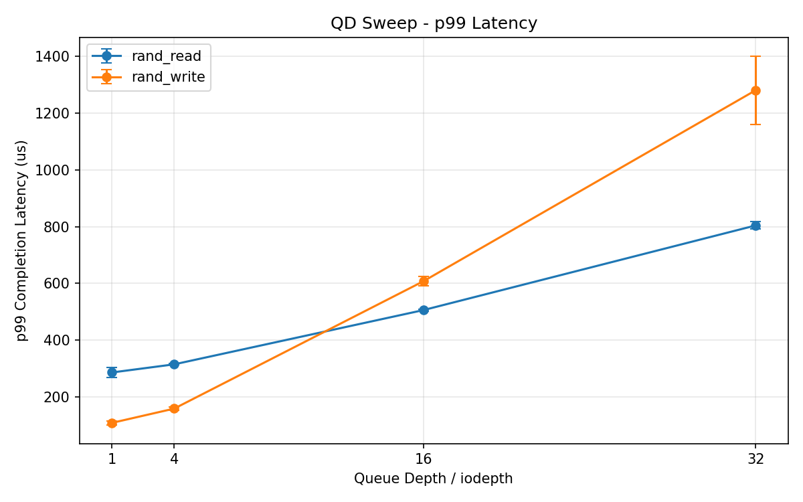
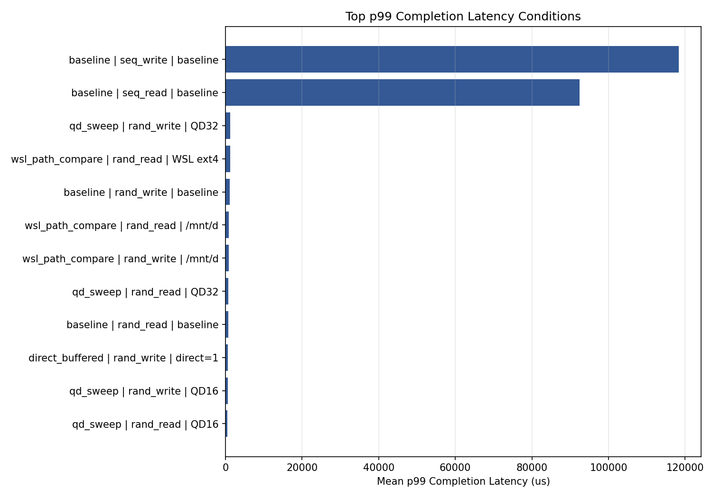
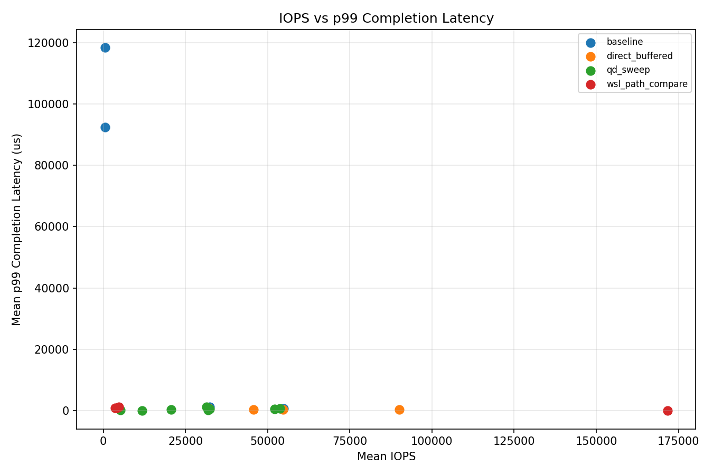
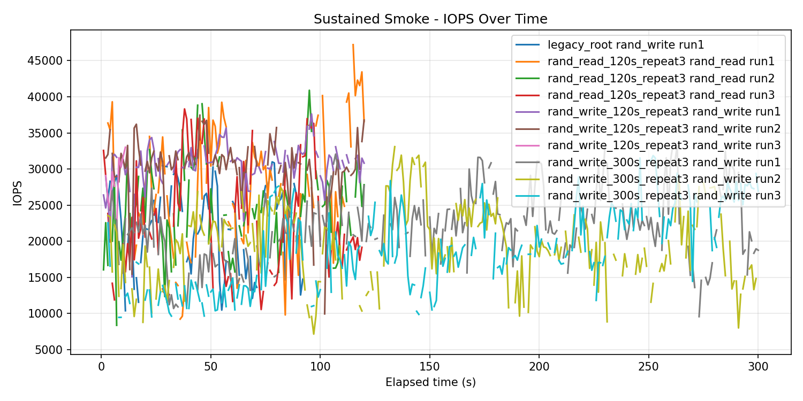
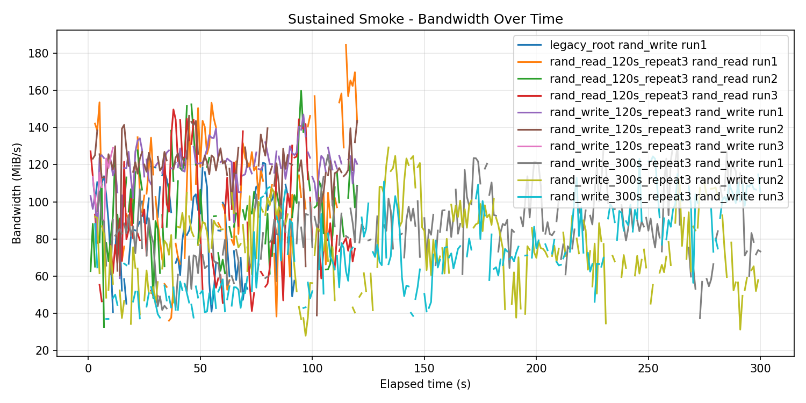
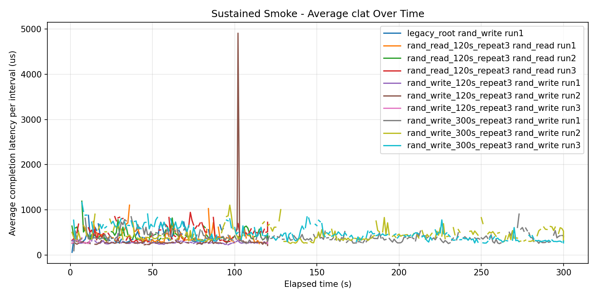

# SSD Mini Lab Portfolio Evidence

This note is a compact portfolio view of the SSD mini lab.

The point is not to show many charts. The point is to show a validation flow:

```text
condition -> execution -> parsed result -> graph -> interpretation boundary
```

## 1. Experiment Condition Matrix

| Track | Question | Controlled condition | Execution | Main output |
|---|---|---|---|---|
| Baseline fio | What is the first observable performance profile? | Windows file-based fio, repeated runs per workload | `run_baseline.ps1` | `results/fio_summary.csv`, `results/plots/` |
| Queue-depth sweep | How does QD change throughput and p99 latency? | 4K random read/write, QD 1/4/16/32 | `run_qd_sweep.ps1` | `results/qd_sweep_grouped.csv`, `results/qd_sweep_plots/` |
| QD reproducibility | Which QD conditions are stable across repeats? | Same QD sweep inputs, run-to-run CV review | `analyze_qd_reproducibility.py` | `results/qd_sweep_reproducibility.csv` |
| Direct vs buffered | How much does OS/filesystem cache change the result? | 4K random read/write, `direct=1` vs `direct=0` | `run_direct_buffered.ps1` | `results/direct_buffered_comparison.csv`, `results/direct_buffered_plots/` |
| WSL path comparison | Does the path layer change fio behavior? | WSL native ext4 vs `/mnt/d` Windows-mounted path | `run_wsl_path_compare.ps1` | `results/wsl_path_compare_comparison.csv`, `results/wsl_path_compare_plots/` |
| QoS review | Which results look risky beyond average IOPS? | p99, p99.9, and CV review across result sets | `analyze_qos_tail_latency.py` | `results/qos_tail_latency_summary.csv`, `results/qos_tail_latency_plots/` |
| Sustained workload | Does longer runtime expose worse tail behavior? | 4K random, QD16, direct=1, 120s/300s repeats | `run_sustained_smoke.ps1` | `results/sustained_smoke_*.csv`, `results/sustained_smoke_plots/` |
| Telemetry recon | What environment facts can be collected safely? | Read-only metadata and telemetry queries only | `scripts/collect_storage_telemetry_windows.ps1` | `results/telemetry/latest/` |

## 2. fio JSON to CSV Flow

fio produces JSON files. The lab keeps those raw files, then parses them into CSV summaries before plotting or writing reports.



Example baseline flow:

```text
results/*.json
  -> parse_fio_results.py
  -> results/fio_summary.csv
  -> plot_fio_summary.py
  -> results/plots/
  -> docs/reports/baseline_v1.md
```

Example sustained flow:

```text
results/sustained_smoke/<label>/*.json
  -> analyze_sustained_smoke.py
  -> results/sustained_smoke_summary.csv
  -> results/sustained_smoke_repeatability.csv
  -> results/sustained_smoke_result_set_comparison.csv
  -> results/sustained_smoke_workload_comparison.csv
  -> results/sustained_smoke_plots/
  -> docs/reports/sustained_workload_week10.md
```

Why this matters:

- Raw fio JSON remains available for audit.
- CSV summaries make repeated conditions comparable.
- Graphs are generated from structured outputs, not manual screenshots.
- Reports separate observed evidence from unsupported device-level claims.

## 3. Representative Result Evidence

### Direct vs Buffered

| Workload | Mode | Avg BW MiB/s | Avg IOPS | Avg p99 us | Interpretation |
|---|---:|---:|---:|---:|---|
| rand_read | direct=1 | 213.92 | 54,762.40 | 392.53 | More direct file path view |
| rand_read | direct=0 | 351.89 | 90,083.22 | 343.38 | Buffered path likely benefits from OS/filesystem cache |
| rand_write | direct=1 | 125.72 | 32,184.05 | 667.65 | More direct file path view |
| rand_write | direct=0 | 178.26 | 45,635.12 | 467.63 | Buffered path changes both throughput and p99 latency |

Evidence:

- CSV: `results/direct_buffered_comparison.csv`
- Report: `docs/reports/direct_buffered_week7.md`



Interpretation boundary:

The buffered result should not be described as "the SSD media is faster." It is evidence that the Windows file path and cache policy can change fio-observed behavior.

### Queue Depth and p99 Latency

| Workload | QD | Avg BW MiB/s | Avg IOPS | Avg p99 us |
|---|---:|---:|---:|---:|
| rand_read | 1 | 20.41 | 5,225.49 | 286.04 |
| rand_read | 4 | 80.79 | 20,681.08 | 314.71 |
| rand_read | 16 | 203.94 | 52,207.00 | 505.86 |
| rand_read | 32 | 209.96 | 53,749.12 | 804.18 |
| rand_write | 1 | 46.06 | 11,790.25 | 108.37 |
| rand_write | 4 | 124.41 | 31,849.25 | 158.72 |
| rand_write | 16 | 126.64 | 32,418.56 | 607.57 |
| rand_write | 32 | 122.55 | 31,371.02 | 1,280.68 |

Evidence:

- CSV: `results/qd_sweep_grouped.csv`
- Report: `docs/reports/reproducibility_qd_sweep.md`



Interpretation boundary:

Higher QD can improve throughput, but p99 latency can worsen. A validation condition should not be selected by average IOPS alone.

### QoS and Tail-Latency View

Evidence:

- CSV: `results/qos_tail_latency_summary.csv`
- Report: `docs/reports/qos_tail_latency_review.md`





Interpretation boundary:

The QoS review is a screening layer. It identifies risky conditions for deeper review, but it does not by itself prove internal SSD mechanisms such as GC, FTL behavior, SLC-cache exhaustion, or thermal throttling.

## 4. Sustained Workload Evidence

Sustained workload tests move from short snapshots to time-based behavior.

| Result set | Workload | Runtime | Size | Runs | Avg BW MiB/s | Avg IOPS | Avg p99 us | Avg p99.9 us | Max-lat CV |
|---|---|---:|---|---:|---:|---:|---:|---:|---:|
| `rand_write_120s_repeat3` | randwrite | 120s | 1G | 3 | 115.70 | 29,620.18 | 722.26 | 1,567.40 | 1.564 |
| `rand_write_300s_repeat3` | randwrite | 300s | 2G | 3 | 77.47 | 19,831.08 | 2,482.18 | 9,011.20 | 1.574 |
| `rand_read_120s_repeat3` | randread | 120s | 1G | 3 | 95.88 | 24,545.59 | 2,482.18 | 9,852.25 | 0.127 |

Key comparison:

| Comparison | IOPS ratio | p99 ratio | p99.9 ratio | Meaning |
|---|---:|---:|---:|---|
| write 300s vs write 120s | 0.670x | 3.437x | 5.749x | Longer runtime exposed worse write-side tail behavior |
| write 120s vs read 120s | 1.207x | 0.291x | 0.159x | Write had higher average IOPS and lower p99/p99.9, but rare max-latency behavior still needed review |

Evidence:

- CSV: `results/sustained_smoke_summary.csv`
- CSV: `results/sustained_smoke_repeatability.csv`
- CSV: `results/sustained_smoke_result_set_comparison.csv`
- CSV: `results/sustained_smoke_workload_comparison.csv`
- Report: `docs/reports/sustained_workload_week10.md`







Interpretation boundary:

The sustained write result shows that longer runtime changed the observed throughput and tail-latency profile. It should still be described as file-based fio behavior on the current OS/path, not as direct proof of an internal SSD root cause.

## 5. What This Demonstrates

This project demonstrates:

- defining test conditions before interpreting numbers
- preserving raw fio JSON and converting it into auditable CSV summaries
- comparing average throughput against p99/p99.9 latency
- checking repeatability with CV instead of trusting one run
- separating direct I/O, buffered I/O, Windows path, WSL path, and sustained runtime effects
- writing interpretation boundaries instead of over-claiming device-level causes

Portfolio sentence:

> I built a small SSD validation lab that turns fio JSON into structured CSVs, compares controlled conditions, visualizes p99 and sustained behavior, and documents what the evidence can and cannot prove.
