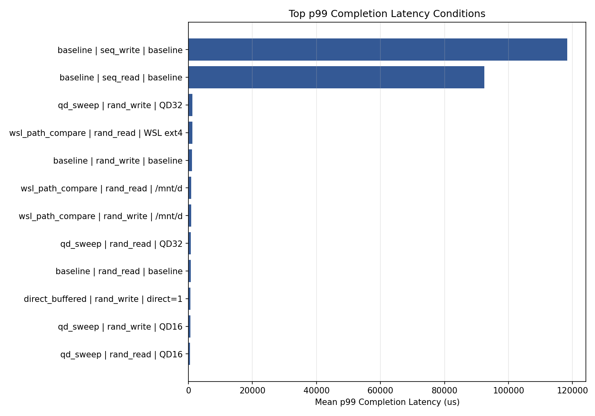
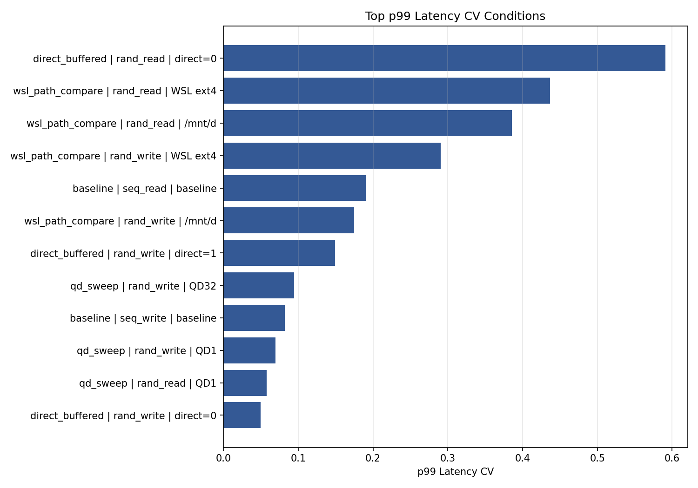
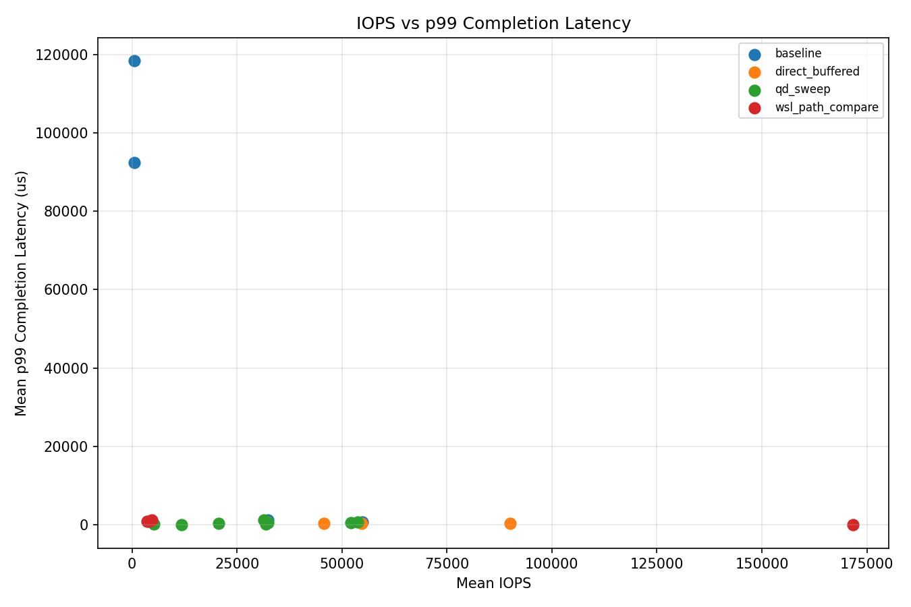

# QoS and Tail Latency Review

## Purpose

This review collects p99, p99.9, and run-to-run CV observations across the mini-lab.

The purpose is to shift the analysis from "which condition has the highest IOPS" to "which condition is stable and predictable enough to trust."

## Inputs

The review is generated from:

| Source | File |
|---|---|
| Baseline CV summary | `results/plots/cv_summary.csv` |
| QD reproducibility | `results/qd_sweep_reproducibility.csv` |
| Direct/buffered grouped result | `results/direct_buffered_grouped.csv` |
| WSL path grouped result | `results/wsl_path_compare_grouped.csv` |

Generated outputs:

| Output | Description |
|---|---|
| `results/qos_tail_latency_summary.csv` | Unified QoS summary table |
| `results/qos_tail_latency_plots/top_p99_latency.png` | Highest p99 latency conditions |
| `results/qos_tail_latency_plots/top_p99_cv.png` | Most variable p99 latency conditions |
| `results/qos_tail_latency_plots/iops_vs_p99_latency.png` | IOPS vs p99 latency scatter |

Rebuild:

```powershell
cd D:\ssd_lab
python .\analyze_qos_tail_latency.py
```

## Important Caution

The rows in this review do not all represent the same workload shape.

Examples:

- Baseline sequential workloads use `1M` block size.
- Random workloads use `4k` block size.
- WSL path comparison uses WSL file paths and `direct=0`.
- Direct/buffered comparison intentionally changes cache behavior.

Therefore, this review should not be read as a single leaderboard. It should be read as a map of where latency risk or interpretation risk appears.

## Highest Absolute p99 Latency

| Experiment | Condition | Workload | p99 mean (us) | p99 CV |
|---|---|---|---:|---:|
| baseline | baseline | seq_write | 118,314.33 | 0.082 |
| baseline | baseline | seq_read | 92,449.45 | 0.190 |
| qd_sweep | QD32 | rand_write | 1,280.68 | 0.094 |
| wsl_path_compare | WSL ext4 | rand_read | 1,208.32 | 0.437 |
| baseline | baseline | rand_write | 1,182.38 | 0.008 |
| wsl_path_compare | `/mnt/d` | rand_read | 879.27 | 0.386 |
| wsl_path_compare | `/mnt/d` | rand_write | 853.33 | 0.174 |
| qd_sweep | QD32 | rand_read | 804.18 | 0.016 |



Interpretation:

- Sequential baseline p99 latency is numerically highest, but those workloads use `1M` block size and should not be directly compared with 4K random workloads.
- Among random 4K QD sweep conditions, `rand_write QD32` is the clearest QoS concern.
- WSL path comparison has high p99 latency for read paths and should be treated as path-sensitive, not device-media-sensitive.

## Highest p99 Latency Variation

| Experiment | Condition | Workload | p99 mean (us) | p99 CV |
|---|---|---|---:|---:|
| direct_buffered | direct=0 | rand_read | 343.38 | 0.591 |
| wsl_path_compare | WSL ext4 | rand_read | 1,208.32 | 0.437 |
| wsl_path_compare | `/mnt/d` | rand_read | 879.27 | 0.386 |
| wsl_path_compare | WSL ext4 | rand_write | 16.13 | 0.291 |
| baseline | baseline | seq_read | 92,449.45 | 0.190 |
| wsl_path_compare | `/mnt/d` | rand_write | 853.33 | 0.174 |
| direct_buffered | direct=1 | rand_write | 667.65 | 0.149 |
| qd_sweep | QD32 | rand_write | 1,280.68 | 0.094 |



Interpretation:

- `direct=0 rand_read` had the highest p99 CV. That supports the earlier interpretation that buffered read results can be cache/path-state sensitive.
- WSL path comparison read results also had high p99 variation.
- A low average latency is not enough if the p99 value is unstable across repeated runs.

## IOPS vs p99 Latency



This plot is useful for spotting tradeoffs:

- Some conditions increase IOPS while also increasing p99 latency.
- Some conditions look fast because of buffering or path effects and should not be interpreted as raw SSD performance.
- For validation, the best condition is not always the condition with the highest IOPS.

## p99.9 Notes

p99.9 is available for QD sweep, direct/buffered, and WSL path comparison rows.

Notable p99.9 observations:

| Experiment | Condition | Workload | p99.9 mean (us) | p99.9 CV |
|---|---|---|---:|---:|
| wsl_path_compare | WSL ext4 | rand_read | 10,693.29 | 0.274 |
| wsl_path_compare | `/mnt/d` | rand_read | 3,448.83 | 0.897 |
| wsl_path_compare | `/mnt/d` | rand_write | 1,794.05 | 0.153 |
| qd_sweep | QD32 | rand_write | 1,695.74 | 0.106 |
| qd_sweep | QD32 | rand_read | 1,078.61 | 0.023 |
| direct_buffered | direct=1 | rand_write | 955.73 | 0.168 |

Interpretation:

- WSL read paths show very large p99.9 values and high variability.
- `rand_write QD32` remains a QoS concern even beyond p99.
- p99.9 is more sensitive to rare slow requests than p99, so repeated runs and longer runtimes are needed before making strong claims.

## Key Lessons

1. Average IOPS is not enough.
2. p99 and p99.9 expose tail behavior that average latency hides.
3. CV helps separate repeatable behavior from unstable measurements.
4. Cache/path-sensitive tests can look fast but unstable.
5. Different block sizes and paths should not be ranked without context.
6. QoS analysis should include both magnitude and stability.

## Interview-Ready Summary

> In this mini-lab, I learned that SSD validation cannot rely on average IOPS alone. Some conditions had strong throughput but worse p99 latency, and some buffered or WSL-path tests showed high variability. I therefore started tracking p99, p99.9, and CV together so that I could distinguish fast-looking results from stable and interpretable results.

## Next Step

The next lab should move from short 15-30 second runs toward a small sustained workload.

The goal should be to observe whether p99/p99.9 latency changes over time, not simply to run a longer benchmark.
