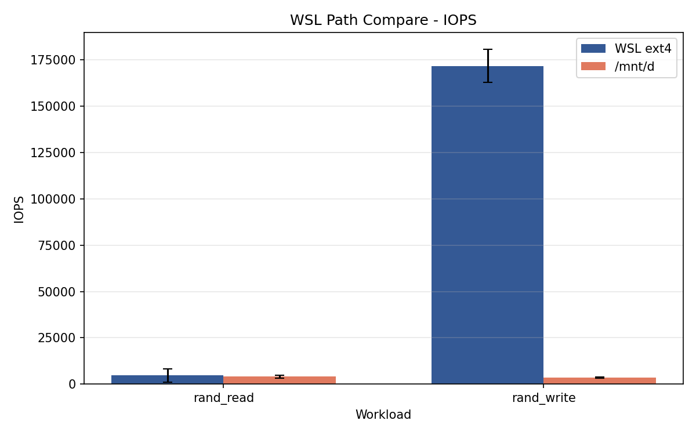
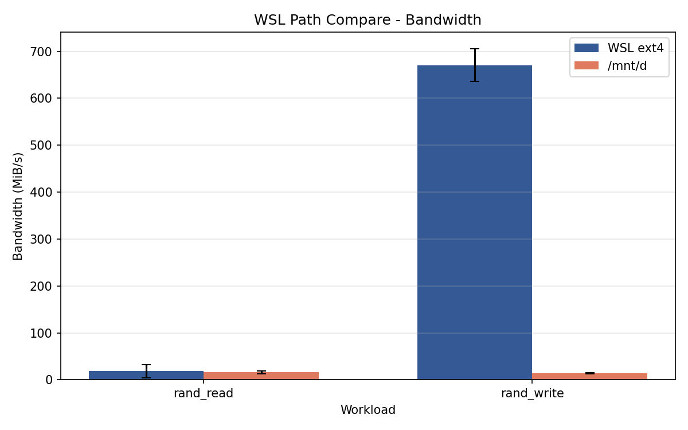
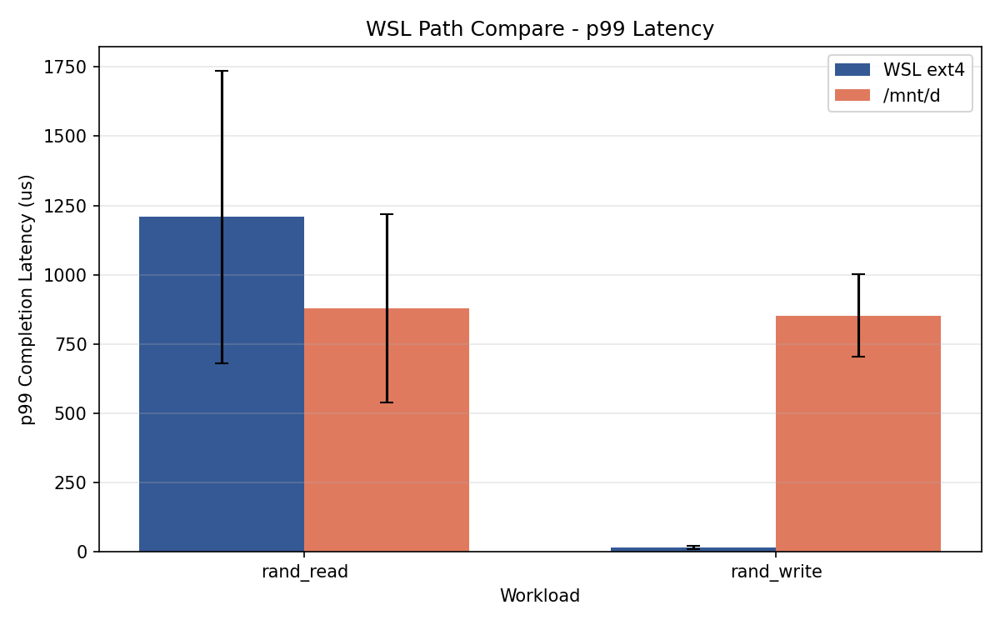
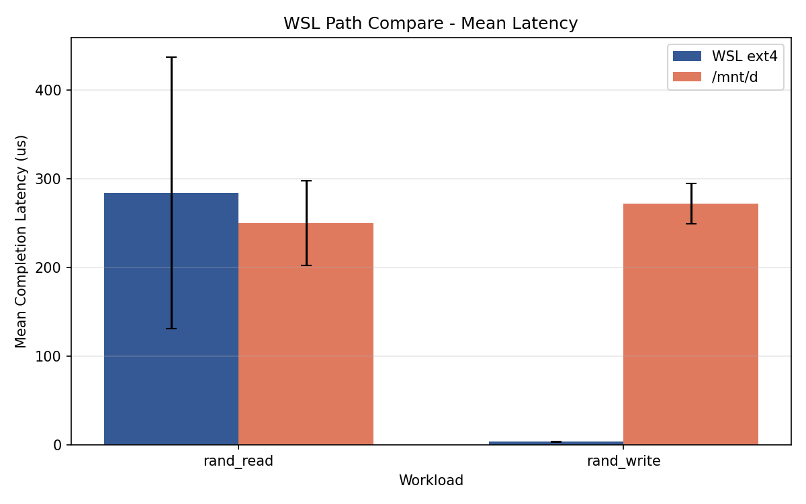

# Week 9 - WSL Path Comparison

## Purpose

This lab compares two safe file-based paths inside WSL:

| Path mode | Example | Meaning |
|---|---|---|
| `wsl_ext4` | `/home/<user>/ssd_lab_wsl_path_compare` | WSL native ext4 virtual disk path |
| `mnt_d` | `/mnt/d/ssd_lab/results/wsl_path_compare_files` | Windows `D:\` mounted into WSL |

The goal is not to measure raw SSD performance. The goal is to observe whether WSL native storage and Windows-mounted storage behave differently under the same fio workload.

## Safety Boundary

This lab uses regular files only.

It does not target raw devices such as:

```text
/dev/sdX
/dev/nvmeXnY
```

The default test size is small:

```text
512M
```

The default runtime is short:

```text
15 seconds
```

## Scripts

| Script | Role |
|---|---|
| `run_wsl_path_compare.ps1` | Windows launcher |
| `scripts/run_wsl_path_compare.sh` | WSL-side fio runner |
| `parse_fio_results.py` | Parses fio JSON into CSV |
| `analyze_wsl_path_compare.py` | Groups results, computes ratios, and creates plots |

## Run

From Windows PowerShell:

```powershell
cd D:\ssd_lab
.\run_wsl_path_compare.ps1
```

Then parse and analyze:

```powershell
python .\parse_fio_results.py `
  --input-dir D:\ssd_lab\results\wsl_path_compare `
  --output D:\ssd_lab\results\wsl_path_compare_summary.csv

python .\analyze_wsl_path_compare.py
```

## Configurable Parameters

The runner supports environment variables:

| Variable | Default | Meaning |
|---|---|---|
| `SSD_LAB_WSL_DISTRO` | `Ubuntu` | WSL distro used by the PowerShell launcher |
| `SSD_LAB_WSL_TEST_SIZE` | `512M` | fio test file size |
| `SSD_LAB_WSL_RUNTIME` | `15` | fio runtime in seconds |
| `SSD_LAB_WSL_RUNS` | `3` | repeats per condition |
| `SSD_LAB_WSL_BS` | `4k` | block size |
| `SSD_LAB_WSL_IODEPTH` | `16` | fio iodepth |
| `SSD_LAB_WSL_DIRECT` | `0` | direct I/O flag |

Example:

```powershell
$env:SSD_LAB_WSL_TEST_SIZE = "256M"
$env:SSD_LAB_WSL_RUNTIME = "10"
.\run_wsl_path_compare.ps1
```

## Expected Outputs

Raw fio JSON:

```text
results/wsl_path_compare/
```

Parsed and analyzed outputs:

```text
results/wsl_path_compare_summary.csv
results/wsl_path_compare_grouped.csv
results/wsl_path_compare_comparison.csv
results/wsl_path_compare_plots/
```

## Interpretation Guide

If `wsl_ext4` and `mnt_d` differ, the result should be interpreted as a path effect, not as a pure SSD media effect.

Possible contributors:

- WSL virtual disk path
- Windows drive mount path
- filesystem behavior
- page cache behavior
- WSL/Windows boundary overhead
- host background I/O

This comparison is useful because Stage 1 already showed that the host I/O path can strongly influence results.

## Result Summary

| workload | path | Avg BW (MiB/s) | Avg IOPS | Avg p99 clat (us) |
|---|---|---:|---:|---:|
| rand_read | WSL ext4 | 18.61 | 4,763.88 | 1,208.32 |
| rand_read | `/mnt/d` | 15.76 | 4,034.06 | 879.27 |
| rand_write | WSL ext4 | 670.78 | 171,720.22 | 16.13 |
| rand_write | `/mnt/d` | 14.25 | 3,647.31 | 853.33 |

Comparison ratios using `/mnt/d` over WSL ext4:

| workload | BW ratio | IOPS ratio | p99 latency ratio |
|---|---:|---:|---:|
| rand_read | 0.847 | 0.847 | 0.728 |
| rand_write | 0.021 | 0.021 | 52.910 |

## Plots









## Observations

The experiment completed as intended:

- Both path modes produced three runs for `rand_read`.
- Both path modes produced three runs for `rand_write`.
- The parser correctly normalized workload names and extracted `path_mode_from_filename`.
- Prefill runs were parsed but excluded from the grouped path comparison analysis.
- CSV summaries and plots were generated successfully.

The result difference is large, especially for random write:

- WSL ext4 reported about `171.7K` random write IOPS.
- `/mnt/d` reported about `3.6K` random write IOPS.
- `/mnt/d` random write p99 latency was about `52.9x` the WSL ext4 p99 latency.

This should not be interpreted as the SSD media being faster in one case. The two paths are different host/filesystem paths:

- WSL ext4 writes to the WSL virtual disk path.
- `/mnt/d` crosses the WSL-to-Windows mounted drive path.
- The test used `direct=0`, so cache and buffering effects are expected.
- The test used a small `512M` file and short `15s` runtime.

For random read, WSL ext4 reported higher average IOPS than `/mnt/d`, but it also showed high run-to-run variation:

| workload | path | IOPS CV | p99 CV |
|---|---|---:|---:|
| rand_read | WSL ext4 | 0.765 | 0.437 |
| rand_read | `/mnt/d` | 0.173 | 0.386 |
| rand_write | WSL ext4 | 0.052 | 0.291 |
| rand_write | `/mnt/d` | 0.084 | 0.174 |

The high read variation means the read result should be treated as a first-pass observation, not a stable conclusion.

## Interpretation

The main conclusion is path sensitivity:

> WSL native ext4 and `/mnt/d` are not interchangeable fio test paths.

The random write difference is the strongest signal. The `/mnt/d` path likely adds overhead from the Windows-mounted filesystem boundary, while the WSL ext4 path benefits from the WSL virtual disk and host-side buffering behavior.

For future WSL-based fio experiments, the path must be labeled explicitly. Mixing results from WSL ext4 and `/mnt/d` would make the analysis misleading.

Recommended interpretation:

- Use WSL ext4 when testing WSL-native file behavior.
- Use `/mnt/d` only when the goal is to study the Windows-mounted path.
- Do not compare either result directly with raw block-device validation.
- Avoid claiming these numbers represent SSD media performance.

## Validation Questions

- Does WSL native ext4 behave differently from `/mnt/d`?
- Is the difference larger for read or write?
- Are p99 latency differences larger than average IOPS differences?
- Are repeated runs stable enough to trust the observed pattern?
- Which path should be used for future WSL-based fio experiments?

## Limitations

- This is still file-based testing, not raw block-device validation.
- WSL native ext4 uses a virtual disk.
- `/mnt/d` goes through the Windows-mounted path.
- `direct=0` is used by default to keep the first comparison simple and compatible.
- Results may depend on cache state, Windows background activity, and WSL state.
- The first-pass run used a small `512M` file and short `15s` runtime.
- WSL ext4 random read had high run-to-run variation.

## Next Step

The next useful step is not to increase complexity immediately. First, preserve this result as a path-sensitivity baseline.

Possible follow-ups:

1. Repeat the same test with `direct=1` if fio and both paths support it.
2. Increase runtime and file size to reduce cache-dominated behavior.
3. Add a QoS-focused report that compares p95/p99/p99.9 across Stage 1 and WSL path tests.
4. Use Obsidian to write a Korean TIL note explaining why path labeling matters in validation.
